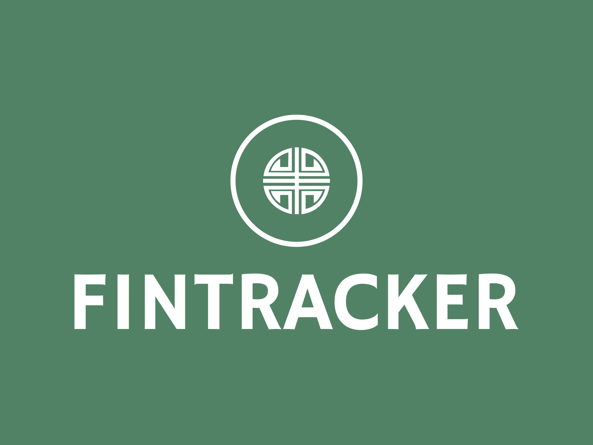

  

This repository contains all the files from my IBDP CS (SL) IA. Packages may stop functioning at any time due to their outdated versions, *let me know if this happens.*

My school did not give component scores, but my IA did score "very well" according to my teacher, which is why I've put it up here *(crit_d and success criteria aren't very good though imo)*. In hindsight, the programming part could've been done much better, but (at least till the next syllabus change) its only the documentation that counts lol.

I've added three elements which were not in my final product, won't be too hard to find what they are though ;)

**Contact:** [badhrihari123@gmail.com](mailto:badhrihari123@gmail.com "Email me!")

